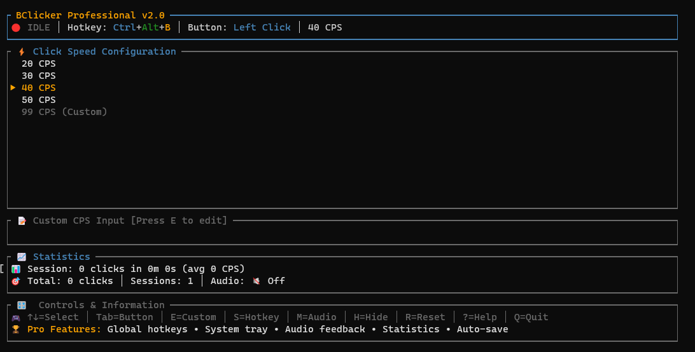

<div align="center">

# BClicker Professional

[](https://github.com/linux-brat/BClicker/releases)
[](https://github.com/linux-brat/BClicker/blob/main/LICENSE)
[](https://www.rust-lang.org/)
[](https://warp.dev)

**A professional Rust-based auto-clicker with a sleek Terminal User Interface**



</div>

## 🚀 Project Overview

BClicker Professional is a high-performance auto-clicker application with a TUI (Terminal User Interface) built using crossterm and tui-rs. The application provides professional auto-clicking functionality with global hotkey support, system tray integration, audio feedback, and statistics tracking.

## ✨ Key Features

<table>
<tr>
<td width="50%">

### 🎮 Core Features

- 🖱️ **High-Precision Clicking**: Microsecond-accurate timing
- ⌨️ **Global Hotkeys**: Control from anywhere (Windows)
- 🎨 **Beautiful TUI**: Terminal-based interface
- 📈 **Statistics Tracking**: Monitor your usage
- 🔊 **Audio Feedback**: Optional click sounds
- 📱 **System Tray**: Background operation

</td>
<td width="50%">

### ⚙️ Technical Features

- 🏁 **Multi-threaded**: Non-blocking performance
- 📋 **TOML Configuration**: Human-readable settings
- 🔔 **Cross-platform**: Windows & Linux support
- 📦 **Portable**: Single executable
- 🚪 **Zero Dependencies**: Standalone operation
- 🔒 **Memory Safe**: Rust guarantees

</td>
</tr>
</table>

---

## 🛠️ Technology Stack

| Component            | Technology          | Purpose                              |
| -------------------- | ------------------- | ------------------------------------ |
| 🦀 **Language**      | Rust (2025 edition) | High-performance systems programming |
| 🖥️ **UI Framework**  | tui-rs + crossterm  | Terminal-based user interface        |
| 🖱️ **Mouse Control** | enigo               | Cross-platform mouse automation      |
| 🔊 **Audio**         | rodio               | Non-blocking sound effects           |
| ⚙️ **Configuration** | TOML + serde        | Human-readable config files          |
| 📱 **System Tray**   | tray-item           | Background system integration        |
| 🔔 **Notifications** | notify-rust         | Cross-platform notifications         |
| 🪟 **Platform**      | Windows + Win32 API | Global hotkey support                |

---

## ⚡ Quick Start (TL;DR)

```bash
# 🚀 Get up and running in 30 seconds!
git clone https://github.com/linux-brat/BClicker.git
cd BClicker
cargo run --release
```

**🎮 Controls:**

- `Space` - Start/Stop clicking
- `Tab` - Switch between presets
- `h` - Help menu
- `q` - Quit

> 💫 **WARP Users**: This works perfectly in WARP terminal with full Unicode support and beautiful rendering!

---

## 📦 Detailed Installation

### 🔧 Prerequisites

- 🦀 **Rust toolchain**: Install from [rustup.rs](https://rustup.rs/)
- 📋 **Git**: For cloning the repository
- 🪟 **Windows**: Windows SDK for global hotkey functionality
- 🐧 **Linux**: Audio development libraries (ALSA/PulseAudio)

---

### 💻 One-Click Installation

#### 🪟 Windows (PowerShell)

```powershell
# 🚀 Quick Setup - Copy & Paste!
git clone https://github.com/linux-brat/BClicker.git
cd BClicker
cargo build --release

# ▶️ Run BClicker
.\target\release\bclicker.exe

# 🌍 Optional: Add to PATH for global access
# Copy target\release\bclicker.exe to C:\Windows\System32\ or your preferred PATH directory
```

> **📝 Note**: Replace `bclicker.exe` with the actual executable name if different

#### 🐧 Linux (Bash)

```bash
# 📦 Install audio libraries (Ubuntu/Debian)
sudo apt update && sudo apt install libasound2-dev pkg-config

# 🎆 For other distributions:
# Fedora: sudo dnf install alsa-lib-devel pkgconf
# Arch: sudo pacman -S alsa-lib pkgconf

# 🚀 Quick Setup - Copy & Paste!
git clone https://github.com/linux-brat/BClicker.git
cd BClicker
cargo build --release

# ▶️ Run BClicker
./target/release/bclicker

# 🌍 Optional: Install system-wide
sudo cp target/release/bclicker /usr/local/bin/
```

### 📦 Direct Cargo Installation

```bash
# 🚀 Install directly from GitHub
cargo install --git https://github.com/linux-brat/BClicker.git

# 🎆 Or install from crates.io (when published)
cargo install bclicker
```

---

## ⚙️ WARP Development Commands

> 💡 **WARP Users**: These commands work perfectly in WARP terminal with syntax highlighting and autocompletion!

### 🔨 Build & Run Commands

| Command                 | Description                | WARP Tip                                                     |
| ----------------------- | -------------------------- | ------------------------------------------------------------ |
| `cargo build`           | 🚀 Debug build             | 📝 Use WARP's AI to explain any build errors                 |
| `cargo build --release` | ⚡ Optimized release build | 📊 View build progress in WARP's enhanced output             |
| `cargo run`             | ▶️ Run in debug mode       | 🔍 Perfect for development with WARP's terminal multiplexing |
| `cargo run --release`   | 🏁 Run optimized version   | ⚙️ Best performance for testing                              |

```bash
# 🚀 Quick Development Cycle
cargo run          # Fast compilation, debug info
cargo run --release # Optimized performance
```

### 🧪 Testing & Code Quality

| Command                       | Purpose              | WARP Feature                          |
| ----------------------------- | -------------------- | ------------------------------------- |
| `cargo test`                  | 🧪 Run all tests     | 📈 Test results beautifully formatted |
| `cargo check`                 | ⚙️ Fast syntax check | ⚡ Lightning-fast feedback loop       |
| `cargo fmt`                   | 🎨 Format code       | 📝 Instant code beautification        |
| `cargo clippy`                | 🔍 Lint analysis     | 💡 Smart suggestions in WARP          |
| `cargo clippy -- -D warnings` | 🛡️ Strict linting    | 🚫 Zero tolerance for warnings        |

```bash
# 🚀 Code Quality Pipeline
cargo check      # Quick syntax validation
cargo fmt        # Auto-format code
cargo clippy     # Catch common issues
cargo test       # Ensure everything works
```

### 🛠️ Development Utilities

```bash
# 🧼 Clean build artifacts
cargo clean

# 🆕 Update dependencies
cargo update

# 🌳 Show dependency tree
cargo tree

# 🔒 Security audit (install with: cargo install cargo-audit)
cargo audit

# 📂 Generate documentation
cargo doc --open

# 📈 Performance profiling
cargo build --release
time ./target/release/bclicker
```

> 💫 **WARP Pro Tip**: Use WARP's AI assistant to explain any cargo commands or help debug build issues!

## Architecture Overview

### Core Application Structure

The application follows a modular architecture with clear separation of concerns:

**Main Components:**

1. **App State Management** (`App` struct) - Central application state, configuration, and UI modes
2. **Event System** - Multi-threaded event handling for input, ticking, and quit signals
3. **Auto-Clicker Engine** - Dedicated thread for mouse clicking with precise timing
4. **UI Rendering** - TUI-based interface with dynamic content and help system
5. **System Integration** - Global hotkeys, system tray, and notifications

### Key Data Structures

**Configuration System:**

- `Config` struct handles all persistent settings
- `Statistics` struct tracks usage metrics across sessions
- `KeyCombo` struct represents global hotkey combinations
- Auto-saves to `bclicker_config.toml` in the current directory

**Threading Architecture:**

- **Main Thread**: UI rendering and input handling
- **Clicker Thread**: High-precision mouse clicking loop
- **Event Threads**: Separate threads for input capture and tick events
- **Hotkey Thread**: Windows-specific global hotkey monitoring
- **Audio Threads**: Spawned per-sound for non-blocking audio

### Input Mode System

The application uses a state machine for different input modes:

- `Normal` - Standard navigation and controls
- `EditingCps` - Custom CPS value input
- `SettingKeybind` - Capturing hotkey combinations
- `AwaitingKeybind` - Brief preparation state before capturing
- `ShowingHelp` - Help screen display

### Platform-Specific Features

**Windows Integration:**

- Global hotkey registration via Win32 API (`RegisterHotKey`)
- System message loop for hotkey detection
- Windows-specific virtual key code mapping

**Cross-Platform Considerations:**

- Mouse control works on all platforms via enigo
- System tray and notifications have fallback behavior
- Global hotkeys currently Windows-only with graceful degradation

## Configuration and Data Files

### Primary Configuration File

- **Location**: `bclicker_config.toml` (current directory)
- **Format**: TOML with nested sections
- **Auto-generated**: Creates default config if missing
- **Auto-saved**: Persists changes immediately

### Configuration Structure

```toml
cps_presets = [20, 30, 40, 50]  # Available CPS preset values
selected_preset = 2              # Currently selected preset index
custom_cps_value = 99           # User-defined CPS value
using_custom_cps = false        # Whether to use custom vs preset
selected_button = 0             # 0=Left, 1=Right mouse button
sound_enabled = false           # Audio feedback toggle

[toggle_keybind]                # Global hotkey configuration
mods = 6                        # Modifier bitmask (1=Shift, 2=Ctrl, 4=Alt)
key = "B"                       # Key character or function key

[statistics]                    # Usage tracking
total_clicks = 0                # All-time click count
session_clicks = 0              # Current session clicks
total_sessions = 0              # Number of application launches
last_session_start = 0          # Unix timestamp
session_duration = 0            # Session length in seconds
```

## Development Considerations

### Performance Characteristics

- **Click Precision**: Microsecond-accurate timing using `Duration::from_micros(1_000_000 / cps)`
- **UI Responsiveness**: 60 FPS rendering loop with conditional redrawing
- **Memory Efficiency**: Minimal allocations in hot paths, Arc/Mutex for shared state
- **CPU Usage**: Adaptive sleep timing based on UI visibility

### Thread Safety Patterns

- `Arc<AtomicBool>` for simple boolean flags (clicker running, UI visibility)
- `Arc<Mutex<T>>` for complex shared data (statistics, configuration)
- MPSC channels for event communication between threads
- Lock contention minimized through brief critical sections

### Error Handling Strategy

- Graceful degradation for system integration features
- Configuration corruption handled with default fallback
- Non-critical errors logged but don't crash application
- Proper cleanup on exit with terminal restoration

### Key Extension Points

**Adding New Features:**

1. **New Input Modes**: Extend `InputMode` enum and add handlers in `handle_input()`
2. **Additional Statistics**: Add fields to `Statistics` struct with migration logic
3. **Audio Enhancements**: Extend `AudioManager` with new sound methods
4. **Platform Support**: Implement platform-specific modules for hotkeys/tray

**UI Customization:**

- Theme system already in place with `Theme` struct
- Modular widget rendering in `draw_ui()` function
- Help system supports scrolling and formatted content
- Status bar easily extensible with new information

### Common Patterns

**Configuration Changes:**

```rust
// Always save config after modifications
app.config.some_setting = new_value;
app.save_config();
app.needs_redraw = true;  // Trigger UI update
```

**Shared State Updates:**

```rust
// Safe access to shared statistics
if let Ok(mut stats) = app.stats_tracker.lock() {
    stats.some_field += 1;
    // Lock automatically released
}
```

**Event-Driven Updates:**

```rust
// Mark redraw needed for next frame
app.needs_redraw = true;
// Only redraw when UI is visible and needs update
```

## Troubleshooting

### Common Build Issues

- **Missing Windows SDK**: Global hotkeys require Windows development headers
- **Audio Dependencies**: rodio may need system audio libraries on Linux
- **Terminal Compatibility**: Some terminals may not support all TUI features

### Runtime Considerations

- **Hotkey Conflicts**: Global hotkeys may conflict with other applications
- **Permission Issues**: Some antivirus software may flag mouse automation
- **Terminal Encoding**: Unicode characters in UI require UTF-8 terminal support

### Development Tips

- Use `cargo run` for development with debug info and faster compilation
- The application handles terminal cleanup automatically on exit
- Configuration file is human-readable and can be manually edited
- Statistics are preserved across application restarts
